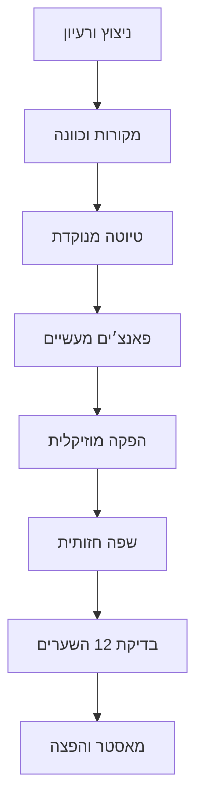

<div dir="rtl" align="right">

# 🎼 אלבום קוד הנשמה — SoulCircuit (SC)

### קודש • תודעה • סייבר • תשובה • מעשה

**SoulCircuit** הוא מרחב היצירה והניהול של אלבום מקורי מאת **Cyber Shamanic — CySh**.  
המאגר מחבר בין שירה יהודית מנוקדת, מסע נפשי אמיתי, פאנצ׳ים מעשיים, הפקה קולנועית־אלקטרונית וזהות חזותית עתידנית־קדושה.

> **רעיון הליבה:** להפוך רעש לאות, כאב לתפילה, קוד לכוונה וכוונה למעשה.

[](CHANGELOG.md)
[](ALBUM.md)
[](TRACKLIST.md)
[](#-עקרונות-הכתיבה)
[](ROADMAP.md)

---

## 🔥 מה המאגר מנהל?

| שכבה | תפקיד | מקור האמת |
|---|---|---|
| 📝 מילים | טקסט מלא, ניקוד, מבנה ופאנצ׳ים | `albums/` |
| 🎛️ הפקה | BPM, סולם, מבנה, סאונד ושירה | `templates/production.md` |
| 📚 מקורות | פסוקים, מאמרי חז״ל ורישום מדויק | `sources/` |
| 🎨 חזות | עטיפות, קליפים, טיפוגרפיה ופרומפטים | `docs/visual-language.md` |
| 🧭 ניהול | קטלוג, סטטוס, גרסאות ובקרת איכות | `catalog/` |
| 📦 הפצה | קרדיטים, מאסטרים וחבילות פרסום | `releases/` |

---

## 🧬 זהות האלבום

- **שם עברי:** קוד הנשמה
- **שם המאגר:** `soul-circuit`
- **שם קצר:** `SoulCircuit`
- **קיצור:** `SC`
- **יוצר ומנהל אמנותי:** Cyber Shamanic — CySh
- **סלוגן:** `Where Code Becomes Prayer.`
- **חתימה עברית:** `כשהקוד מקבל נשמה — הרעש הופך לתפילה.`
- **מסגרת:** ארבעה שערים × עשרה שירים = 40 יחידות יצירה
- **אלבום ראשון:** 12 שירים נבחרים מתוך הקטלוג הראשי

---

## 🗺️ מפת המאגר

```text
soul-circuit/
├── albums/                 # אלבומים, רצפים ותיקיות שיר
├── catalog/                # קטלוג־על: מזהים, סטטוסים ונושאים
├── docs/                   # שפה יצירתית, מוזיקלית וחזותית
├── sources/                # רישום מקורות וייחוס
├── templates/              # תבניות להקמת שיר חדש
├── scripts/                # בדיקות אוטומטיות
├── releases/               # מפרטי חבילות הפצה
├── .github/                # תהליכי Issue, PR ו־CI
├── ALBUM.md                # חזון האלבום הראשון
├── TRACKLIST.md            # מפת 40 השירים
├── GITHUB-SETUP.md         # הוראות פתיחה ודחיפה
└── ROADMAP.md              # מסלול מ־0.1.0 עד מאסטר
```

---

## 🎙️ עקרונות הכתיבה

כל שיר במאגר נכתב לפי הסטנדרט האישי של Cyber Shamanic:

1. עברית מלאה, שירית ומנוקדת.
2. אורך יעד של `3,333–5,000` תווים לטקסט המלא.
3. מבנה מסומן: `[נְשִׁימָה]`, `[פְּתִיחַ]`, `[בַּיִת]`, `[גֶּשֶׁר]`, `[פִּזְמוֹן]`, `[שִׂיא]`, `[סִיּוּם]`.
4. בכל חלק מרכזי מופיעה שורת **פאנץ׳ הלכה למעשה**.
5. שפה קדושה שאינה בורחת מן המציאות: שבר, תיקון, אחריות, אמונה ופעולה.
6. בסיום כל שיר מופיע מפרט הפקה מוזיקלית עד 1,000 תווים.
7. כל ציטוט מקודש נרשם ביומן המקורות לפני הפצה.
8. שם ה׳ נשמר בצורה מכבדת ובהתאם למדיניות הפרויקט.

התקן המלא נמצא ב־[`docs/lyrics-standard.md`](docs/lyrics-standard.md).

---

## ⚙️ תהליך יצירת שיר



לכל שיר נוצרת תיקייה באמצעות `templates/track/`, ולאחר מכן מעדכנים את `catalog/tracks.yml`.

הוראות פתיחת המאגר והדחיפה נמצאות ב־[`GITHUB-SETUP.md`](GITHUB-SETUP.md).

---

## 🚀 התחלה מהירה

```bash
git clone https://github.com/Cyber-Shamanic/soul-circuit.git
cd soul-circuit
python3 scripts/new_track.py SC-01 song-slug "שם השיר"
python3 scripts/validate_repo.py
```

> `new_track.py` מייצר תיקיית שיר מלאה מתוך התבנית ואינו מחליף תיקייה קיימת.

---

## 🏷️ מצבי עבודה

`seed` → `sources` → `draft` → `lyrics-lock` → `production` → `mix` → `master` → `released`

כל מעבר מצב מחייב השלמת השער המתאים ב־[`templates/review-checklist.md`](templates/review-checklist.md).

---

## 🤝 קרדיטים

- **חזון, מילים, זהות וניהול אמנותי:** [Cyber Shamanic](https://github.com/Cyber-Shamanic)
- **יצירת קשר:** [cybershamanic@gmail.com](mailto:cybershamanic@gmail.com)
- **WhatsApp:** [+972 53-536-6687](https://wa.me/972535366687)
- קרדיטים למלחינים, מפיקים, נגנים, זמרים, מעצבים ומקורות יתווספו לכל שיר בנפרד.

## 🕰️ חותמת הקמה

- **תאריך לועזי:** יום שישי, 24 ביולי 2026
- **תאריך עברי:** יום שישי, י׳ באב ה׳תשפ״ו
- **שעת הקמה:** 02:37, שעון ישראל
- **גרסה:** `0.1.0`
- **מספר המידות במאגר:** 12 שערי איכות

> **״לֵב טָהוֹר בְּרָא־לִי אֱלֹהִים; וְרוּחַ נָכוֹן חַדֵּשׁ בְּקִרְבִּי.״** — תהילים נ״א, י״ב

</div>
